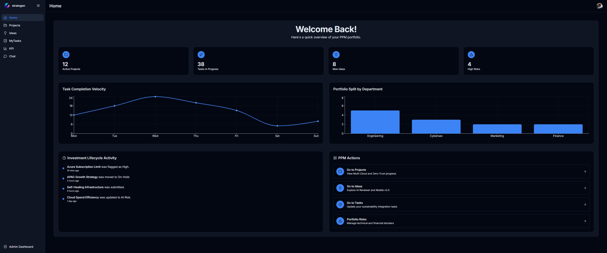
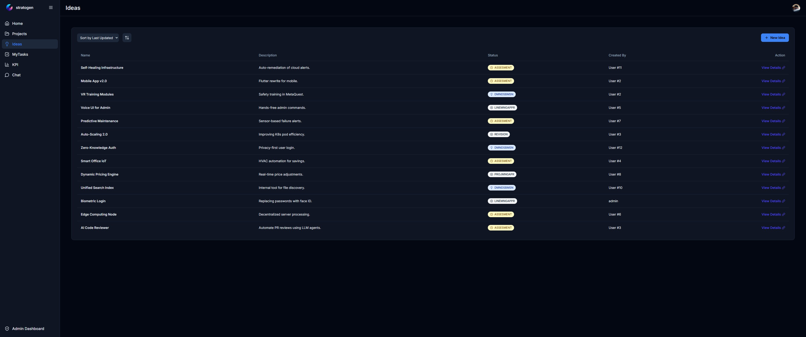
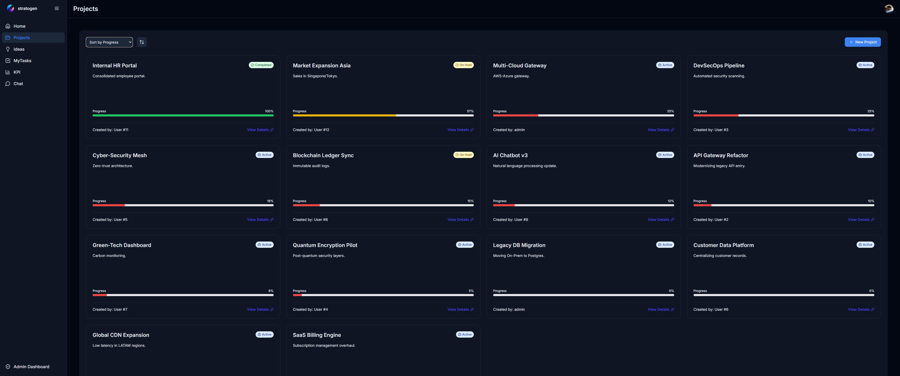
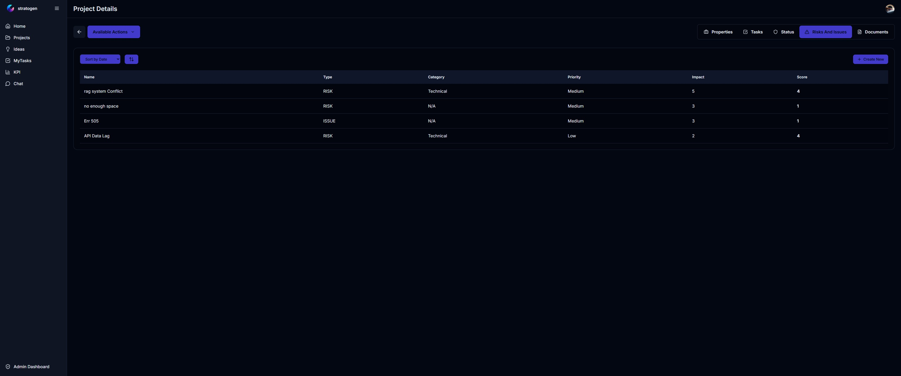
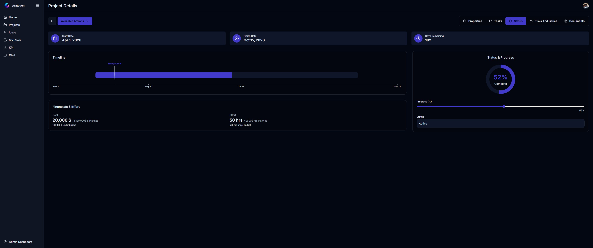
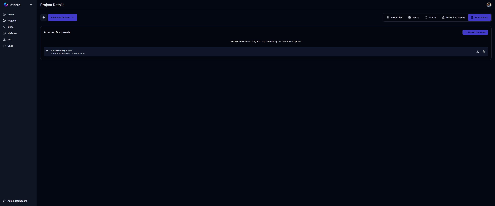
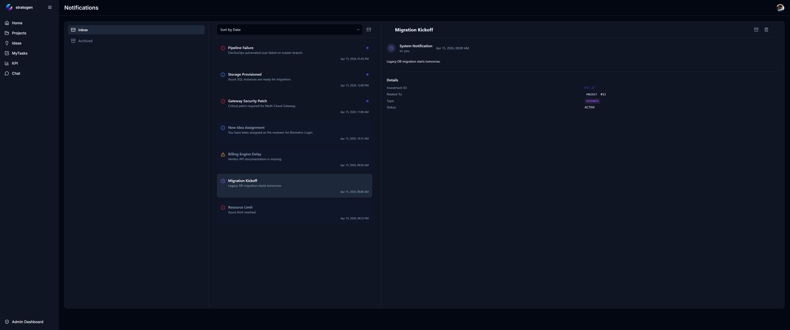
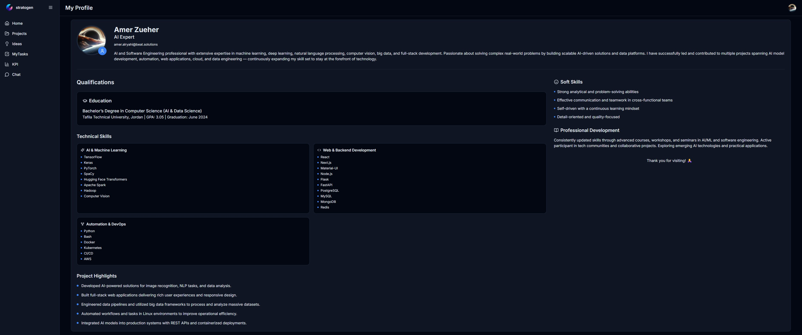
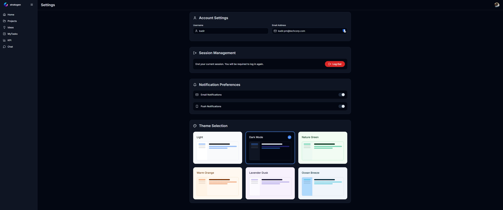
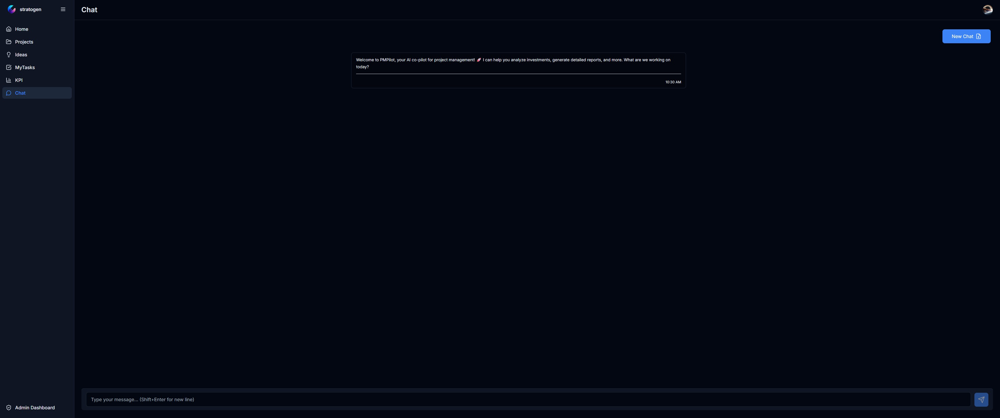

# 🚀 Stratogen — AI-Powered Project Portfolio Intelligence Platform

[](#-architecture)
[](#-architecture)
[](#-architecture)
[](Backend/pyproject.toml)

---

## ✨ Overview

**Stratogen** is a **next-generation, AI-powered Project Portfolio Management (PPM) platform** engineered to orchestrate the full investment lifecycle — from ideation to execution and beyond.

It combines **enterprise-grade architecture**, **intelligent automation**, and **refined user experience** to deliver clarity, control, and strategic insight at every level of the organization.

---

## 💡 Why Stratogen

Stratogen is built for organizations that demand **precision, scalability, and intelligence** in decision-making.

- 🎯 **Unified Portfolio Control** — Manage ideas, projects, risks, and execution in one cohesive ecosystem
- 🤖 **Embedded AI Intelligence** — Context-aware insights, recommendations, and automation
- 🔐 **Enterprise-Grade Access Control** — Role-based workflows with full governance
- ⚡ **Modern, Scalable Stack** — High-performance backend and reactive frontend architecture
- 📊 **Executive-Level Visibility** — Real-time dashboards designed for strategic clarity

---

## 🛠️ Development Status

This application is currently under active development and evolving quickly. The platform is designed to support progressive enhancements while maintaining a clean, modular architecture.

---

## 🚀 Roadmap

Planned improvements and future feature areas include:

- Admin dashboard for managing users, roles, workflows, and permissions
- Expanded workflow automation and advanced business rule configuration
- More control features, governance capabilities, and user administration
- Support for additional AI models, richer analytics, and smarter recommendations
- Improved UX, expanded frontend modules, and production-grade hardening

---

## 🌟 Core Capabilities

### 📌 Lifecycle Orchestration

Drive seamless transitions across **ideas → proposals → projects → execution**, with structured approvals and traceability.

### ⚠️ Risk & Issue Governance

Maintain full visibility into risks and issues with **ownership clarity, prioritization, and lifecycle tracking**.

### 📈 Performance Intelligence

Deliver **structured, real-time reporting** tailored for both operational teams and executive leadership.

### 📂 Document Intelligence Hub

Centralized access to **artifacts, reports, and analytical assets**, organized for efficiency and discoverability.

### 🤖 AI Co-Pilot

Built-in AI capabilities to enhance:

- Decision support
- Data interpretation
- Strategic recommendations

### 🔔 Smart Notification Engine

Stay aligned with **real-time alerts, assignments, and workflow-driven updates**.

---

## 🏗️ Architecture

### 🔧 Backend

- FastAPI (high-performance async APIs)
- Async SQLAlchemy ORM
- Alembic migrations
- JWT authentication
- Modular, AI-ready service design

### 🎨 Frontend

- React 18 + TypeScript
- Vite (ultra-fast build tooling)
- Scalable, component-driven UI architecture

### ⚙️ Infrastructure

- Docker Compose (PostgreSQL + Redis)
- PM2 process management
- Production-ready deployment structure

---

## 📁 Repository Structure

```text
PPM/
├── Backend/                # FastAPI services, models, migrations
├── Frontend/              # React application
├── IMG/                   # Product UI visuals
├── docker-compose.yml     # Infrastructure services
├── ecosystem.config.js    # PM2 configuration
└── ReleaseSummary.md      # Release notes
```

---

## ⚡ Quick Start

### 1️⃣ Clone the repository

```bash
git clone https://github.com/AmerZuher/Stratogen.git
cd stratogen
```

### 2️⃣ Configure the backend environment

> NOTE: if you prefer, the default `.env` values should work for local development.

```bash
cd Backend
cp Secret/.env.example Secret/.env
```

### 3️⃣ Start the app with Docker Compose

```bash
docker compose up
```

This command starts the platform and required services, including PostgreSQL and Redis.

> Tip: add `-d` to run the stack in detached mode when you want the terminal free.

**Default local access:**

- Username: `admin`
- Password: `4tZ%?(2YAgUP`

> Note: These credentials are intended for local development and demo use only.

**Services:**

- PostgreSQL → `localhost:5432`
- Redis → `localhost:6379`

---

## 📌 Local Access

### Backend

- API → [http://localhost:8000](http://localhost:8000)
- Health → [http://localhost:8000/health](http://localhost:8000/health)
- Docs → [http://localhost:8000/docs](http://localhost:8000/docs)

### Frontend

- App → [http://localhost:5173](http://localhost:5173)

---

## ⚙️ Optional: PM2 Runtime

```bash
pm2 start ecosystem.config.js
pm2 list
pm2 logs backend
pm2 logs frontend
```

---

# 🖼️ Product Experience

> Carefully designed interfaces focused on clarity, balance, and decision efficiency.

---

### 📊 Executive Dashboard

<p align="center">
  
</p>

A **high-impact executive cockpit** delivering a consolidated view of portfolio health, KPIs, and strategic progress — enabling faster, data-driven decisions.

---

### 💡 Idea Management

<p align="center">
  
</p>

An **intuitive innovation workspace** designed to capture, evaluate, and mature ideas into actionable initiatives.

---

### 📁 Project Execution

<p align="center">
  
</p>

A **structured execution environment** for planning, ownership tracking, and delivery governance — optimized for control and transparency.

---

### ⚠️ Risk & Issue Control

<p align="center">
  
</p>

A **dedicated governance layer** providing clear prioritization, mitigation workflows, and full lifecycle tracking.

---

### 📈 Status & Reporting

<p align="center">
  
</p>

A **refined reporting interface** delivering consistent, structured updates tailored for stakeholders at all levels.

---

### 📂 Document Center

<p align="center">
  
</p>

A **centralized knowledge hub** ensuring seamless access to critical documents and analytical outputs.

---

### 🔔 Notifications

<p align="center">
  
</p>

A **streamlined alert system** that keeps users informed without noise — focused, timely, actionable.

---

### 👤 User Profile

<p align="center">
  
</p>

A **personalized control space** for managing identity, preferences, and contextual access.

---

### ⚙️ Settings

<p align="center">
  
</p>

A **flexible configuration layer** with user-centric controls, customization options, and a clean UX.

---

### 🤖 AI Assistant

<p align="center">
  
</p>

An **embedded AI co-pilot** that enhances productivity through contextual insights, recommendations, and intelligent assistance.

---

## 📚 Documentation

- Backend → `Backend/README.md`
- Releases → `ReleaseSummary.md`

---

## 📜 License

Licensed under the **MIT License**.

---

## 🔥 Closing Statement

**Stratogen is not just a PPM tool — it is a strategic intelligence layer** that transforms how organizations evaluate, prioritize, and execute investments.

---
